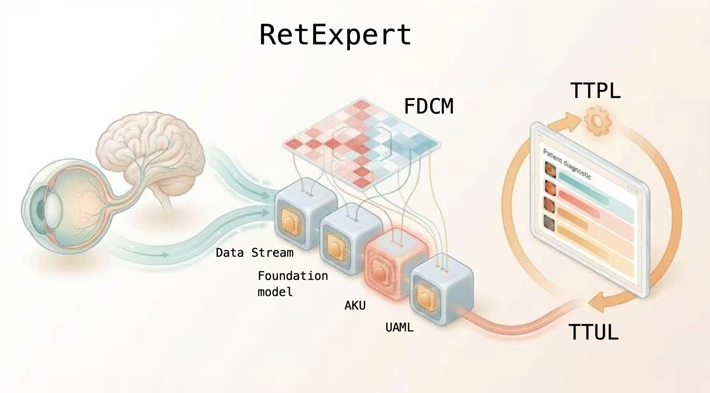

# RetExpert: A test-time Clinically Adaptive Framework for Retinal Disease Detection

[](https://opensource.org/licenses/MIT)
[](https://pytorch.org/)

OFFICIAL IMPLEMENTATION of the paper **"RetExpert: A test-time clinically adaptive framework for detecting multiple fundus diseases by harnessing ophthalmic foundation models"**.



---

## 📖 Overview

**RetExpert** is a unified framework designed to bridge the gap between ophthalmic foundation models (like RETFound) and test-world clinical applications. It addresses three critical challenges:
**long-tail distribution**, **disease co-occurrence confusion**, and **domain shift**.

### 🔍 Key Innovations

1. **Knowledge Unit (KU) Adapters**
   Lightweight adapters embedded into foundation models for parameter-efficient fine-tuning.
2. **FDCM (Fundus Disease Co-occurrence Matrix)**
   Explicitly models pathological dependencies to avoid medically contradictory predictions.
3. **UAML (Uncertainty-Aware Multi-Label Learning)**
   Estimates uncertainty for each label and down-weights ambiguous samples.
4. **Test-time TTA (Test-Time Adaptation)**
   Two-stage online adaptation (TTUL + TTPL) that adjusts the model dynamically for unseen domains (e.g., different cameras).

---

## 🛠️ Installation

### 1. Clone the repository

```bash
git clone https://github.com/OVS-AILab/RetExpert.git
cd RetExpert
```


---

### 2. Install dependencies

```bash
pip install -r requirements.txt
```

Core dependencies:

`torch`, `torchvision`, `timm`, `pandas`, `numpy`, `scikit-learn`, `opencv-python`

---

## 📂 Data Preparation

The dataset structure should follow the format below.

Data loading logic is defined in `utils/datasets.py`.

---

### **MuReD Dataset (Multi-label)**

```
/path/to/MuReD/

├── train.csv      # Contains columns: ID, DR, NORMAL, MH, ... (20 classes)
├── test.csv
└── images/
      ├── image001.png
      ├── image002.png
      └── ...
```

---

### **ODIR-5K Dataset**

```
/path/to/ODIR-5K/

├── train.xlsx
├── test.xlsx
└── ODIR-5K_Training_Dataset_Processed/
      ├── 1.png
      ├── 2.png
      └── ...
```

---

### **ADMD (External Validation)**

```
/path/to/ADMD/

├── test.csv       # Columns: id_code, normal, AMD
└── images/
      ├── img001.png
      ├── img002.png
      └── ...
```

---

## 🚀 Training

Example: Train RetExpert on **MuReD** using RAL + FDCM + UAML + SOA:

```bash
# set GPU devices
export CUDA_VISIBLE_DEVICES=0,1,2,3

# pretrained model path
PRETRAINED_PATH="../pretrained_model/RETFound_cfp_weights.pth"
DATA_PATH="../data/MuReD"

# start distributed training
# adapter_mode: AKU, AKU_tt
# tuning_mode: adapter (adapter, projection, head, norm), head, batchnorm, full, last_blocks
python -m torch.distributed.launch --nproc_per_node=4 --master_port=29500 train.py \
    --dataset MuReD \
    --data_path ${DATA_PATH} \
    --nb_classes 20 \
    --model vit_large_patch16 \
    --finetune ${PRETRAINED_PATH} \
    --input_size 224 \
    --batch_size 16 \
    --epochs 200 \
    --lr 1e-3 \
    --weight_decay 0.05 \
    --criterion RAL \
    --adapter_mode AKU \
    --tuning_mode adapter \
    --beta_UAML 0.1 \
    --gamma_FDCM 0.1 \
    --alpha_SOA 0.1 \
    --output_dir ./output_dir/mured_retexpert_run1 \
    --seed 42
```

---

## 🧪 Test-Time Adaptation (TTA)

Perform instance-specific TTA on an unseen dataset (e.g.,  **ADMD** ):

```bash
export CUDA_VISIBLE_DEVICES=0

# path to ADAM dataset
DATA_PATH="../data/ADAM"
# use the checkpoint from MuRed-RetExpert
CHECKPOINT_PATH="./output_dir/mured_retexpert_run1/checkpoint-best.pth"

echo "Starting Test-Time Adaptation on ADAM..."

# adapter_mode: AKU, AKU_tt
# adaptation_mode: ttul (adapter, projection, norm), adapter, head, batchnorm, full, last_blocks
python test_tta.py \
    --dataset ADAM \
    --data_path ${DATA_PATH} \
    --nb_classes 20 \
    --model vit_large_patch16 \
    --finetune ${CHECKPOINT_PATH} \
    --input_size 224 \
    --batch_size 1 \
    --tta_lr 0.001 \
    --ttul_epochs 1 \
    --ttpl_epochs 1 \
    --adapter_mode AKU \
    --adaptation_mode adapter \
    --output_dir ./output_dir/tta_ADAM_results

echo "TTA Finished."
```

---

## Acknowledgements

This project is built upon or inspired by the following open-source projects. We thank the authors for their great work.

- **ARC**: [Official Repository Link Here](https://github.com/DavidYanAnDe/ARC) 
- **RAL**: [Official Repository Link Here](https://github.com/kalelpark/RAL)
- **UIOS**: [Official Repository Link Here](https://github.com/LooKing9218/UIOS)
- **RetFound**: [KidsWithTokens/RETFound_MAE](https://github.com/rmaphoh/RETFound)
- **ViT**: [google-research/vision_transformer](https://github.com/lucidrains/vit-pytorch) or [timm](https://github.com/huggingface/pytorch-image-models)

---

## 📝 Citation

If this work helps your research, please cite:

```
@article{jiang2025retexpert,
  title={RetExpert: A test-time clinically adaptive framework for detecting multiple fundus diseases by harnessing ophthalmic foundation models},
  author={Jiang, Hongyang and Liu, Zirong and Gao, Mengdi and others},
  journal={Journal},
  year={2025}
}
```

---

## 📧 Contact

For any questions, please contact **Our** at  *[ovsailab@gmail.com]* .
